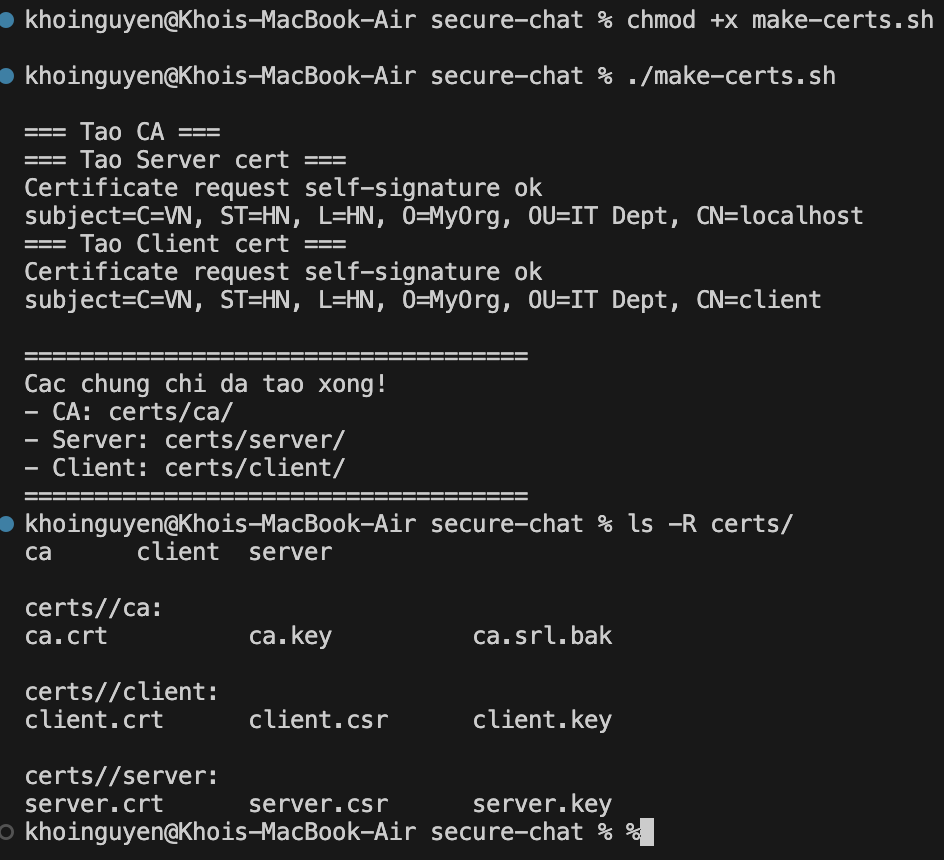
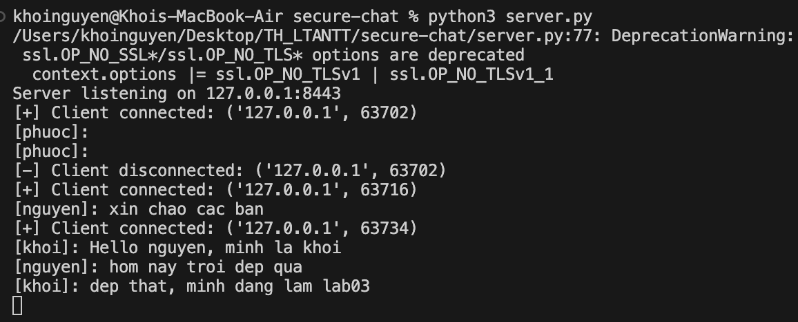
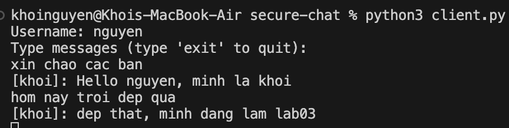
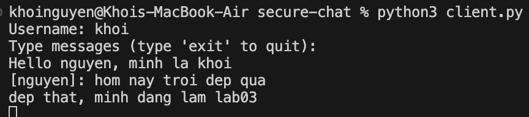
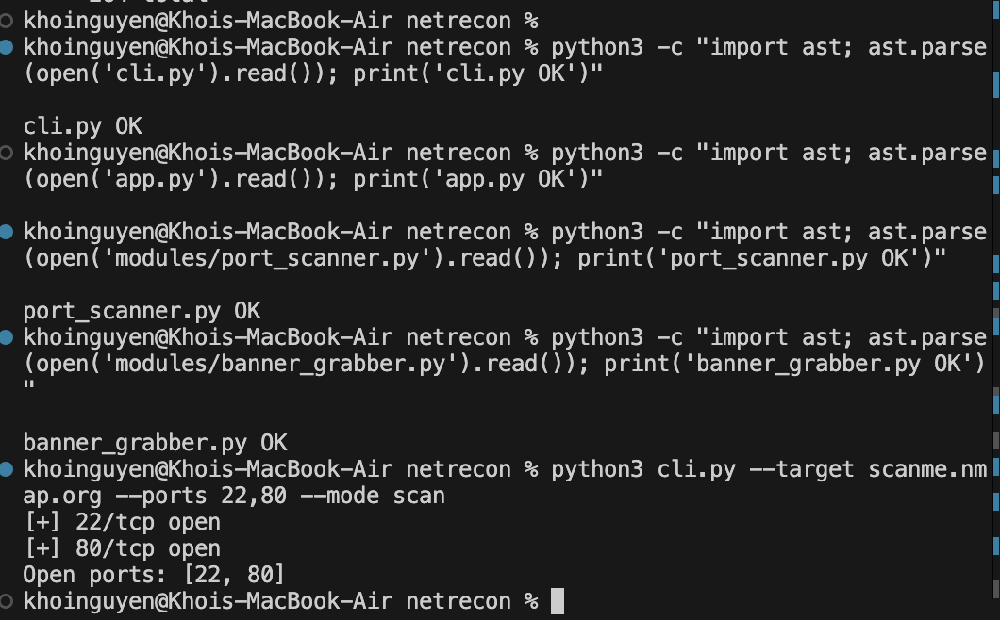
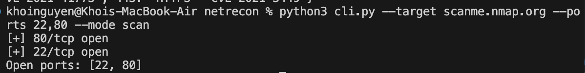
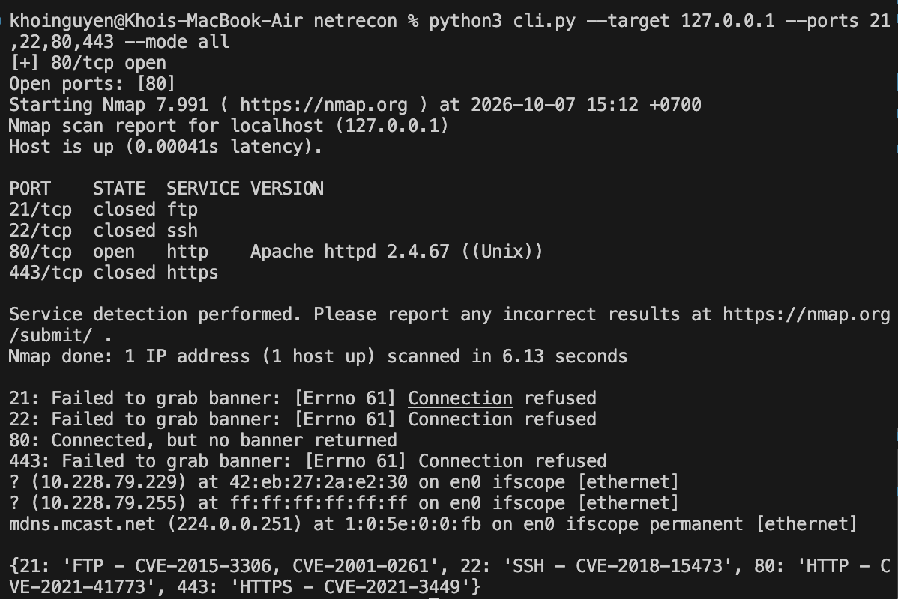
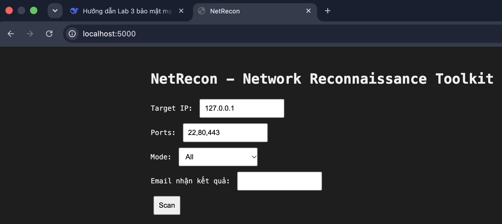
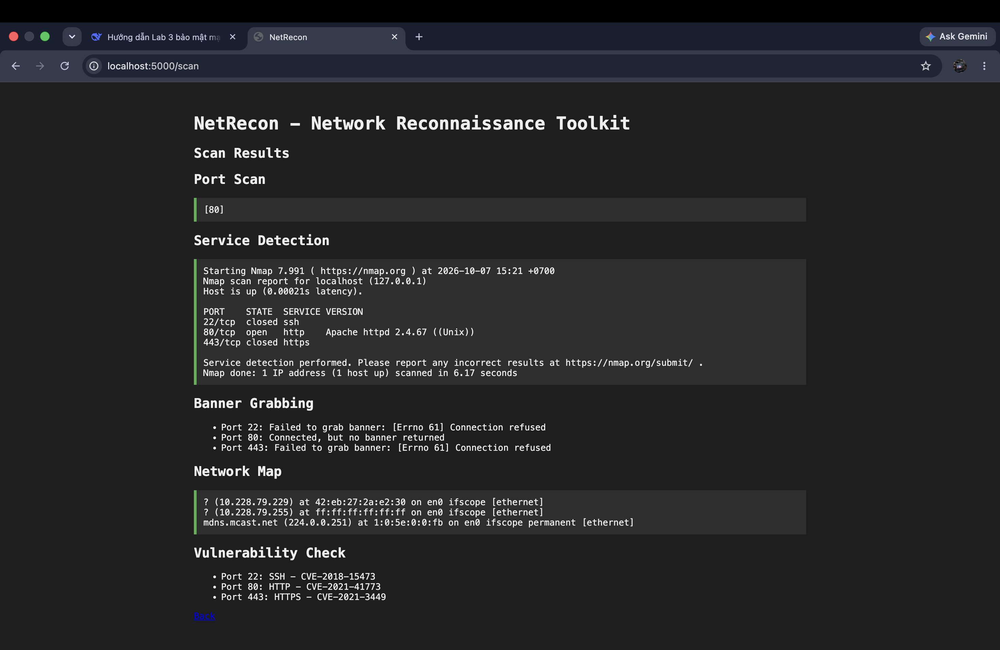
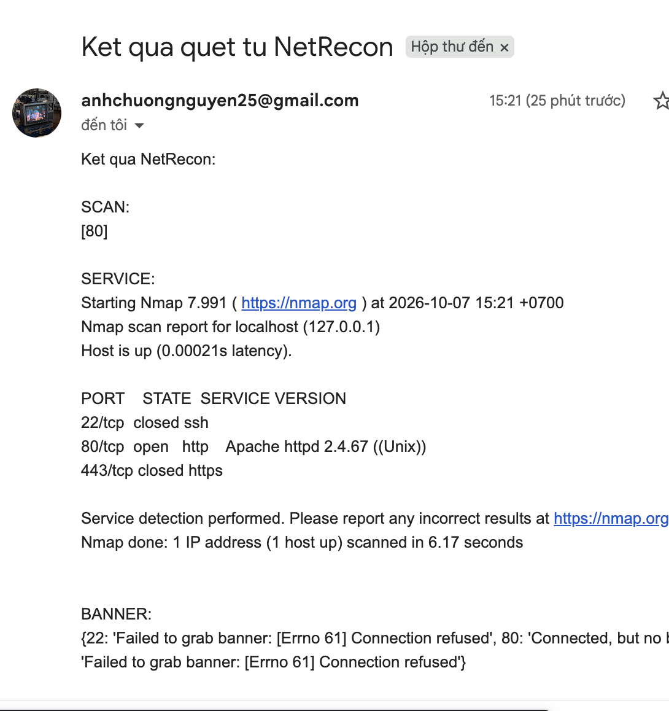

# Lab 3: Lập Trình An Ninh Thông Tin

**Sinh viên:** Nguyễn Ngọc Khôi Nguyên  
**Môi trường:** macOS (Apple Silicon M-series)  
**Python:** 3.13.15  
**OpenSSL:** 3.6.4  
**Nmap:** 7.991  

---

## Mục lục

- [Phần A: SecureChat — Ứng dụng chat bảo mật SSL/TLS](#phần-a-securechat--ứng-dụng-chat-bảo-mật-ssltls)
  - [A.1 Chuẩn bị môi trường](#a1-chuẩn-bị-môi-trường)
  - [A.2 Tạo chứng chỉ SSL/TLS](#a2-tạo-chứng-chỉ-ssltls)
  - [A.3 Viết code ứng dụng](#a3-viết-code-ứng-dụng)
  - [A.4 Kiểm thử](#a4-kiểm-thử)
- [Phần B: NetRecon — Công cụ quét mạng](#phần-b-netrecon--công-cụ-quét-mạng)
  - [B.1 Chuẩn bị môi trường](#b1-chuẩn-bị-môi-trường)
  - [B.2 Cấu trúc dự án](#b2-cấu-trúc-dự-án)
  - [B.3 Kiểm thử CLI](#b3-kiểm-thử-cli)
  - [B.4 Kiểm thử Web](#b4-kiểm-thử-web)
- [Kết luận](#kết-luận)

---

# Phần A: SecureChat — Ứng dụng chat bảo mật SSL/TLS

## A.1 Chuẩn bị môi trường

Kiểm tra các công cụ đã có sẵn trên macOS:

```bash
python3 --version    # Python 3.13.15
pip3 --version       # pip 26.2.1
openssl version      # OpenSSL 3.6.4
brew --version       # Homebrew 7.0.8
```

![Kiểm tra môi trường]

Cài đặt thư viện mã hóa AES cho Python:

```bash
pip3 install cryptography
```

**Kết quả:** `Successfully installed cryptography-50.0.1`

---

## A.2 Tạo chứng chỉ SSL/TLS

### A.2.1 Cấu hình `openssl.cnf`

Tạo file `openssl.cnf` để cấu hình thông tin Root CA:

```ini
[req]
distinguished_name = req_distinguished_name
x509_extensions = v3_ca
prompt = no

[req_distinguished_name]
C = VN
ST = HN
L = HN
O = MyOrg
OU = IT Dept
CN = MyRootCA

[v3_ca]
subjectKeyIdentifier = hash
authorityKeyIdentifier = keyid:always,issuer
basicConstraints = critical, CA:true
keyUsage = critical, keyCertSign, cRLSign
```

> **Lưu ý:** PDF gốc ghi `keyCertsSign` (sai) — đã sửa thành `keyCertSign`.

### A.2.2 Script sinh chứng chỉ `make-certs.sh`

```bash
#!/bin/bash

cd "$(dirname "$0")"
mkdir -p certs/ca certs/server certs/client

# Tao CA
openssl genrsa -out certs/ca/ca.key 2048
openssl req -x509 -new -nodes -key certs/ca/ca.key -sha256 -days 3650 \
    -out certs/ca/ca.crt -config openssl.cnf -extensions v3_ca

# Tao Server cert
openssl genrsa -out certs/server/server.key 2048
openssl req -new -key certs/server/server.key -out certs/server/server.csr \
    -subj "/C=VN/ST=HN/L=HN/O=MyOrg/OU=IT Dept/CN=localhost"
openssl x509 -req -in certs/server/server.csr -CA certs/ca/ca.crt \
    -CAkey certs/ca/ca.key -CAcreateserial \
    -out certs/server/server.crt -days 365 -sha256

# Tao Client cert
openssl genrsa -out certs/client/client.key 2048
openssl req -new -key certs/client/client.key -out certs/client/client.csr \
    -subj "/C=VN/ST=HN/L=HN/O=MyOrg/OU=IT Dept/CN=client"
openssl x509 -req -in certs/client/client.csr -CA certs/ca/ca.crt \
    -CAkey certs/ca/ca.key -CAcreateserial \
    -out certs/client/client.crt -days 365 -sha256

echo "Cac chung chi da tao xong!"
```

Chạy script:

```bash
chmod +x make-certs.sh
./make-certs.sh
```

**Kết quả:**

```
Certificate request self-signature ok
subject=C=VN, ST=HN, L=HN, O=MyOrg, OU=IT Dept, CN=localhost
Certificate request self-signature ok
subject=C=VN, ST=HN, L=HN, O=MyOrg, OU=IT Dept, CN=client

Cac chung chi da tao xong!
- CA: certs/ca/
- Server: certs/server/
- Client: certs/client/
```



### A.2.3 Cấu trúc chứng chỉ

```
certs/
├── ca/
│   ├── ca.crt        (Root CA certificate)
│   ├── ca.key        (Root CA private key)
│   └── ca.srl.bak    (Serial backup)
├── client/
│   ├── client.crt    (Client certificate)
│   ├── client.csr    (Client certificate signing request)
│   └── client.key    (Client private key)
└── server/
    ├── server.crt    (Server certificate)
    ├── server.csr    (Server certificate signing request)
    └── server.key    (Server private key)
```


---

## A.3 Viết code ứng dụng

### A.3.1 `message_encryption.py` — Mã hóa AES-256-CBC

Class `MessageEncryption` cung cấp 2 phương thức:
- `encrypt(plaintext)`: Trả về `IV (16 bytes) + ciphertext`, padding PKCS7
- `decrypt(ciphertext)`: Tách IV, giải mã, bỏ padding

### A.3.2 `connection_manager.py` — Quản lý kết nối

Lưu trữ dict `{socket: {username, encryption_key}}` với `threading.Lock` để đảm bảo thread-safe.

### A.3.3 `room_manager.py` — Quản lý phòng chat

Mặc định có phòng `general`. Mỗi phòng chứa tập hợp các socket.

### A.3.4 `server.py` — Server SSL đa luồng

- Load chứng chỉ server + CA
- Yêu cầu client certificate (`ssl.CERT_REQUIRED`) — xác thực 2 chiều
- Mỗi client kết nối được xử lý trong 1 thread riêng
- Broadcast tin nhắn đã giải mã rồi mã hóa lại bằng key AES của từng client

### A.3.5 `client.py` — Client SSL

- Sinh AES key 256-bit ngẫu nhiên
- Gửi `username:hex(aes_key)` cho server qua kênh TLS
- Thread nhận tin nhắn, thread chính gửi tin nhắn

---

## A.4 Kiểm thử

### A.4.1 Chạy Server

```bash
python3 server.py
```

**Kết quả:**

```
Server listening on 127.0.0.1:8443
```



### A.4.2 Client 1 — `nguyen`

```bash
python3 client.py
Username: nguyen
Type messages (type 'exit' to quit):
xin chao cac ban
[khoi]: Hello nguyen, minh la khoi
hom nay troi dep qua
[khoi]: dep that, minh dang lam lab03
```



### A.4.3 Client 2 — `khoi`

```bash
python3 client.py
Username: khoi
Type messages (type 'exit' to quit):
Hello nguyen, minh la khoi
[nguyen]: hom nay troi dep qua
dep that, minh dang lam lab03
```



### A.4.4 Nhận xét

✅ **Xác thực 2 chiều (mutual TLS)** hoạt động: Server từ chối client không có cert.  
✅ **Mã hóa đầu-cuối**: Mỗi client có AES key riêng, server giải mã rồi mã hóa lại cho từng client.  
✅ **Đa luồng**: Nhiều client chat đồng thời.  
✅ **TLS 1.2+**: Cấu hình `OP_NO_TLSv1 | OP_NO_TLSv1_1` để chặn giao thức cũ.

---

# Phần B: NetRecon — Công cụ quét mạng

## B.1 Chuẩn bị môi trường

### B.1.1 Cài Nmap

```bash
brew install nmap
nmap --version    # Nmap 7.991
```

![Nmap version]
### B.1.2 Google App Password

Truy cập https://myaccount.google.com/apppasswords, tạo mật khẩu ứng dụng 16 ký tự cho ứng dụng "Netrecon".

![Google App Password]

### B.1.3 File `.env`

```
SMTP_USER=email_cua_ban@gmail.com
SMTP_PASS=xxxx xxxx xxxx xxxx
```

> **Bảo mật:** Không commit file `.env` lên Git — đã thêm vào `.gitignore`.


---

## B.2 Cấu trúc dự án

```
netrecon/
├── modules/
│   ├── __init__.py
│   ├── port_scanner.py       # Quét cổng TCP async
│   ├── banner_grabber.py     # Lấy banner dịch vụ
│   ├── service_detector.py   # Phát hiện version (nmap -sV)
│   ├── network_mapper.py     # ARP scan
│   ├── vuln_checker.py       # Tra CVE
│   └── email_sender.py       # Gửi mail SMTP SSL
├── static/
│   └── style.css
├── templates/
│   ├── index.html            # Form nhập
│   └── result.html           # Trang kết quả
├── app.py                    # Flask web
├── cli.py                    # CLI (Click)
├── requirements.txt
└── .env
```

### Các module chính

| Module | Chức năng | Kỹ thuật |
|--------|-----------|----------|
| `port_scanner` | Quét cổng TCP | `asyncio` + `Semaphore(rate_limit)` |
| `banner_grabber` | Lấy banner | Socket timeout 2s |
| `service_detector` | Phát hiện version | `subprocess` gọi `nmap -sV` |
| `network_mapper` | ARP table | `arp -a` (macOS) |
| `vuln_checker` | Tra CVE | Dict hardcoded |
| `email_sender` | Gửi mail | `smtplib.SMTP_SSL('smtp.gmail.com', 465)` |

### Fix lỗi cross-platform

File `service_detector.py` từ PDF dùng đường dẫn Windows `C:\Program Files (x86)\Nmap\nmap.exe`, đã sửa thành `"nmap"` để chạy được trên macOS (Homebrew thêm nmap vào PATH).

---

## B.3 Kiểm thử CLI

### B.3.1 Quét scanme.nmap.org

```bash
python3 cli.py --target scanme.nmap.org --ports 22,80 --mode scan
```



### B.3.2 Chế độ all trên localhost

```bash
python3 cli.py --target 127.0.0.1 --ports 21,22,80,443 --mode all
```

**Kết quả:**

```
[+] 80/tcp open
Open ports: [80]
Starting Nmap 7.991 ( https://nmap.org )
Nmap scan report for localhost (127.0.0.1)
PORT    STATE  SERVICE VERSION
21/tcp  closed ftp
22/tcp  closed ssh
80/tcp  open   http    Apache httpd 2.4.67 ((Unix))
443/tcp closed https

21: Failed to grab banner: [Errno 61] Connection refused
80: Connected, but no banner returned
...
{21: 'FTP - CVE-2015-3306, CVE-2001-0261',
 22: 'SSH - CVE-2018-15473',
 80: 'HTTP - CVE-2021-41773',
 443: 'HTTPS - CVE-2021-3449'}
```



**Nhận xét:**
- ✅ PortScanner: phát hiện cổng 80 mở
- ✅ ServiceDetector: nhận diện chính xác **Apache httpd 2.4.67**
- ✅ BannerGrabber: báo lỗi hợp lý cho cổng đóng
- ✅ NetworkMapper: hiện ARP table của interface `en0`
- ✅ VulnChecker: tra CVE theo cổng

---

## B.4 Kiểm thử Web

### B.4.1 Chạy Flask

```bash
python3 app.py
```

Kiểm tra:

```bash
curl -I http://localhost:5000
# HTTP/1.1 200 OK
# Server: Werkzeug/3.1.9 Python/3.13.15
```


### B.4.2 Form nhập liệu

Mở trình duyệt vào `http://localhost:5000`:



### B.4.3 Kết quả scan

Nhập:
- Target IP: `scanme.nmap.org`
- Ports: `22,80`
- Mode: `All`
- Email: `your-email@gmail.com`

Nhấn **Scan** → kết quả hiển thị:



### B.4.4 Email thông báo

Kết quả scan được gửi về Gmail dưới dạng email:



---

# Kết luận

## Kết quả đạt được

✅ **Phần A — SecureChat:**
- Hiểu và áp dụng SSL/TLS 2 chiều (mutual authentication)
- Sinh và quản lý chứng chỉ số với OpenSSL
- Mã hóa AES-256-CBC đầu-cuối
- Lập trình socket đa luồng với `threading`

✅ **Phần B — NetRecon:**
- Quét cổng bất đồng bộ với `asyncio`
- Lấy banner dịch vụ, phát hiện phiên bản
- Khám phá mạng LAN, kiểm tra CVE
- Xây dựng CLI (Click) + Web UI (Flask)
- Gửi báo cáo tự động qua email SMTP SSL

## Kỹ năng đạt được

- Lập trình socket bảo mật với Python `ssl` module
- Sử dụng OpenSSL CLI để tạo PKI
- Áp dụng mã hóa đối xứng (AES) kết hợp xác thực bất đối xứng (RSA/TLS)
- Lập trình bất đồng bộ (asyncio) cho tác vụ I/O
- Xây dựng ứng dụng web với Flask
- Tích hợp dịch vụ bên thứ ba (Gmail SMTP)

## Hạn chế

- AES key được trao đổi plaintext trong kênh TLS (thực tế nên dùng ECDH)
- CVE database hardcoded, chưa cập nhật real-time
- Chưa có rate limiting phía server cho broadcast