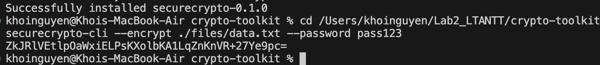
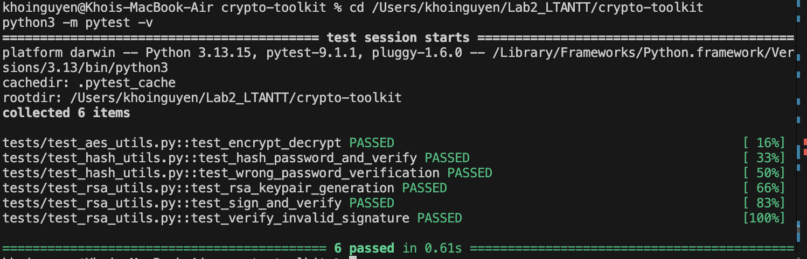
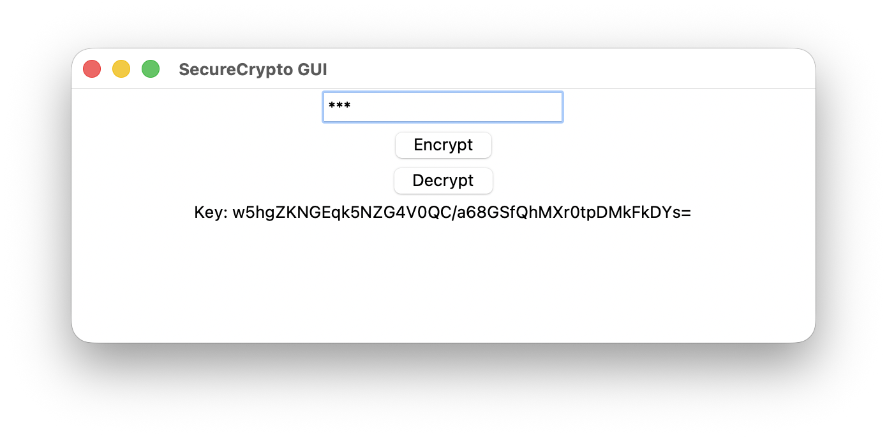
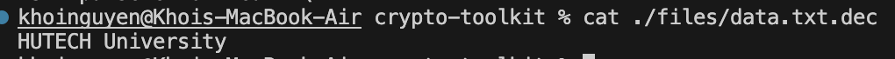
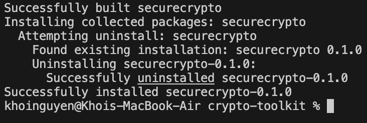
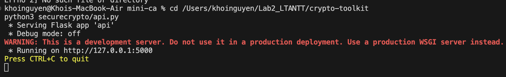

# BÁO CÁO BÀI LAB 2: MÃ HOÁ VÀ TRIỂN KHAI PKI

**Thông tin sinh viên:**
- **Họ và tên:** Khoi Nguyen
- **Lớp:** 23DATA1
- **Môn học:** Lập trình An ninh thông tin

---

## PHẦN 1: THỰC HÀNH CRYPTO-TOOLKIT

### 1. Cài đặt Package

```bash
cd crypto-toolkit
pip3 install -e .
```



Kết quả: cài đặt thành công `securecrypto==0.1.0` cùng các thư viện `cryptography`, `argon2-cffi`, `flask`.

### 2. Kiểm thử Unit Tests

```bash
python3 -m pytest -v
```



Kết quả: **6/6 bài test PASSED**.

### 3. Thực thi CLI — Mã hoá AES-256-GCM

```bash
securecrypto-cli --encrypt ./files/data.txt --password pass123
```



Kết quả trả về khoá Base64 dùng để giải mã.

### 4. Kiểm tra nội dung file sau giải mã

```bash
securecrypto-cli --decrypt ./files/data.txt.enc --password <KEY>
cat ./files/data.txt.dec
```



→ Nội dung khôi phục đúng: **`HUTECH University`**

### 5. Kiểm tra Giao diện GUI (Tkinter)

```bash
python3 securecrypto/app_gui.py
```



### 6. Khởi động Flask API

```bash
python3 securecrypto/api.py
```



Server lắng nghe tại `http://127.0.0.1:5000`.

> **Ghi chú:** Postman Web không thể gọi `127.0.0.1` (lỗi `Cloud Agent Error`), phần kiểm thử API sẽ bổ sung sau bằng Postman Desktop Agent hoặc `curl`.
